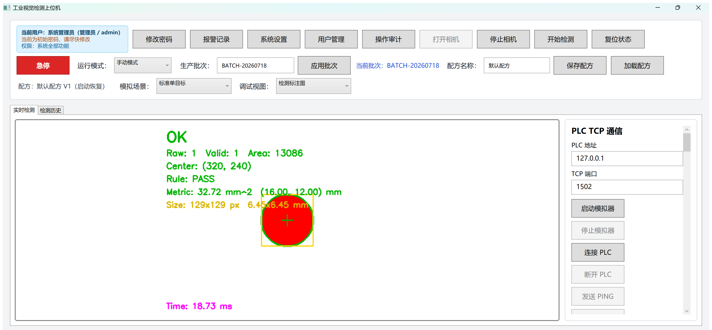
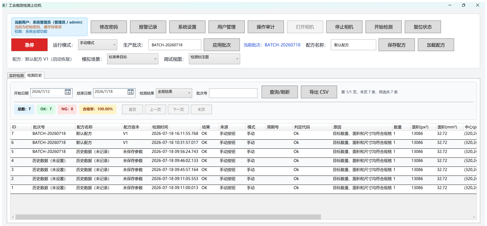
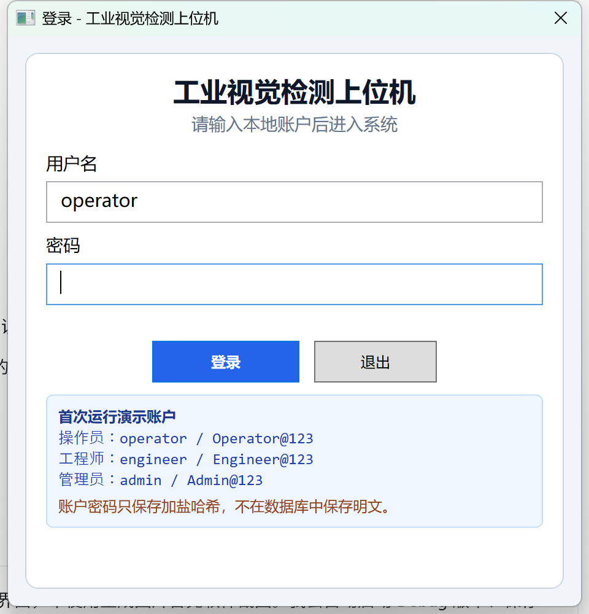
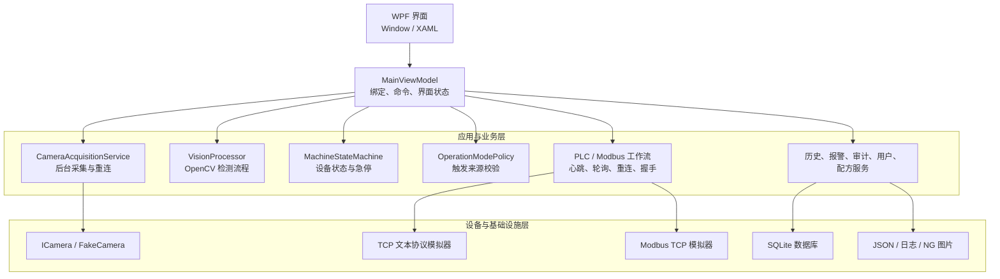
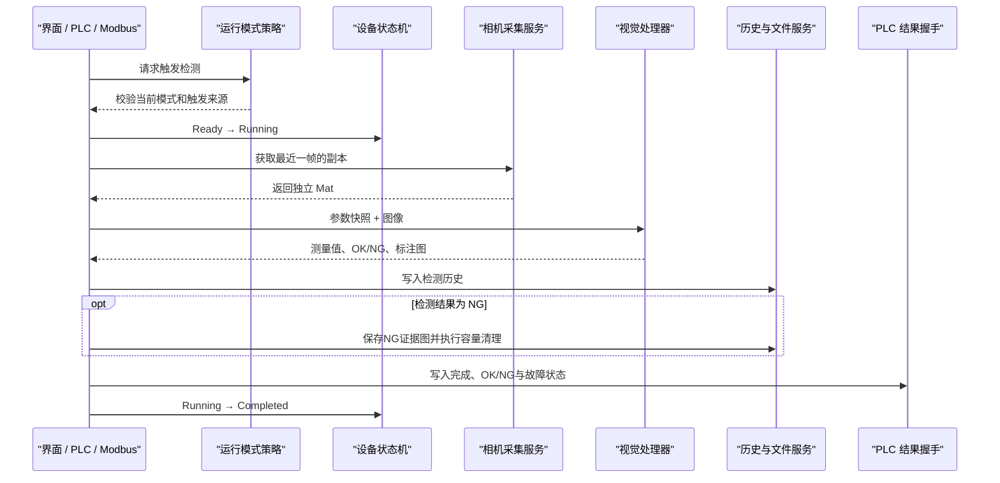

# 工业视觉检测上位机

一套面向工业自动化学习与作品展示的 Windows 桌面上位机，使用 C#、WPF、OpenCvSharp、TCP、Modbus TCP 和 SQLite 实现从图像采集、视觉检测、设备状态控制到生产追溯的完整软件链路。

项目在没有真实工业相机和 PLC 的条件下，通过模拟相机、文本协议 PLC 服务端和 Modbus TCP 服务端完成开发、故障注入与自动化验证。代码为未来接入真实设备预留了相机接口和独立通信层，但当前测试结果不代表真实产线性能。

## 项目状态

- 当前版本：`1.0.0`
- 目标平台：Windows x64
- 技术框架：.NET 6、WPF、OpenCvSharp、SQLite
- 构建状态：Debug / Release 均为0警告、0错误
- 自动化测试：75个测试全部通过
- 发布方式：Windows x64自包含文件夹

## 界面预览

### 实时视觉检测



### 检测历史与统计



### 本地账户登录



## 核心功能

### 图像采集与视觉检测

- 使用`ICamera`抽象相机能力，通过`FakeCamera`模拟工业相机
- 支持连续采集、停止、采集异常、取消和自动重连
- 内置单目标、双目标、小目标、噪声、移动目标和采集失败等模拟场景
- 支持ROI、灰度化、高斯滤波、阈值分割、开闭运算和轮廓筛选
- 测量目标数量、面积、圆度、中心、宽高和处理耗时
- 支持像素坐标与毫米坐标、像素面积与物理面积换算
- 显示原图、灰度图、二值图、形态学图和最终检测标注图
- 根据数量、面积、宽度和高度规格输出OK/NG及机器判定代码

### 自动化与工业通信

- 支持手动模式和自动模式
- 使用状态机管理`Idle`、`Ready`、`Running`、`Completed`、`Fault`和`Emergency`
- 实现本机文本协议PLC模拟器和TCP客户端
- 支持PING、心跳、超时、断线检测和指数退避重连
- 实现Modbus TCP客户端、服务端、线圈和保持寄存器访问
- 支持界面、文本PLC和Modbus三种检测触发来源
- 完成启动、忙、完成、OK/NG和故障状态握手

### 数据、权限与运维

- 使用SQLite保存检测历史、用户、报警和操作审计
- 支持按时间、批次和OK/NG查询，分页显示、统计并导出CSV
- 只保存NG证据图，并按保存天数和总容量自动清理
- 使用JSON保存视觉配方和系统设置
- 内置操作员、工程师、管理员三级角色和权限控制
- 支持密码修改、用户管理、操作审计、报警发生/确认/恢复
- 支持浅色/深色主题以及窗口状态恢复
- 运行日志按日期写入本地文件

## 系统架构



一次检测的主要调用链：



## 技术栈

| 分类 | 使用技术 | 在项目中的用途 |
|---|---|---|
| 语言与平台 | C#、.NET 6 | 业务逻辑、异步任务、资源管理 |
| 桌面界面 | WPF、XAML、MVVM | 数据绑定、命令、权限化界面 |
| 机器视觉 | OpenCvSharp 4.9 | 阈值、滤波、形态学、轮廓和标注 |
| 工业通信 | TCP、Modbus TCP | PLC模拟、心跳、握手和自动触发 |
| 数据存储 | SQLite、JSON、CSV | 历史追溯、用户、报警、配方和导出 |
| 并发与稳定性 | Task、CancellationToken、lock、IDisposable | 后台采集、停止、重连和非托管资源释放 |
| 测试 | xUnit、Coverlet | 单元、集成、并发、性能和稳定性测试 |

## 项目结构

```text
IndustrialVisionHost
├─ Camera/                 相机接口、模拟相机和模拟场景
├─ Commands/               WPF命令实现
├─ Communication/          TCP、心跳、重连和Modbus TCP
├─ Models/                 检测、状态、用户、报警等数据模型
├─ Services/               采集、状态机、数据库、配方和日志服务
├─ Utils/                  WPF图像转换与OpenCV辅助方法
├─ ViewModels/             主界面与视觉参数ViewModel
├─ Vision/                 OpenCV视觉检测流程
├─ tests/                  xUnit自动化测试工程
├─ tools/                  独立长时间稳定性运行器
├─ scripts/                测试与发布脚本
├─ docs/                   路线、进度、基线和发布文档
├─ App.xaml                应用入口和全局资源
└─ MainWindow.xaml         主界面布局
```

## 快速开始

### 开发环境运行

准备以下环境：

- 64位Windows 10或Windows 11
- Visual Studio 2022，并安装“.NET桌面开发”工作负载
- .NET 6 SDK

克隆项目后打开`IndustrialVisionHost.sln`，还原NuGet包，将`IndustrialVisionHost`设为启动项目，然后运行。

也可以在项目根目录执行：

```powershell
dotnet restore IndustrialVisionHost.sln
dotnet run --project IndustrialVisionHost.csproj
```

### 生成免安装运行目录

```powershell
powershell -ExecutionPolicy Bypass -File scripts\publish-release.ps1
```

输出目录默认为：

```text
artifacts\release\IndustrialVisionHost-v1.0.0-win-x64
```

进入该目录并运行`IndustrialVisionHost.exe`。自包含发布不要求目标电脑预装.NET运行时。

## 演示账号

首次启动会创建以下本地演示账号：

| 角色 | 用户名 | 初始密码 | 主要权限 |
|---|---|---|---|
| 操作员 | `operator` | `Operator@123` | 运行检测、查看历史和报警 |
| 工程师 | `engineer` | `Engineer@123` | 操作员权限、配方和系统设置 |
| 管理员 | `admin` | `Admin@123` | 全部权限、用户管理和操作审计 |

Release版本首次登录必须修改初始密码。以上账号只用于本地演示，不应直接用于实际生产环境。

## 推荐演示流程

1. 使用操作员账号登录。
2. 点击“打开相机”，观察模拟相机连续采集。
3. 选择标准单目标并执行检测，观察轮廓、中心、尺寸和OK判定。
4. 切换双目标或小目标场景，执行检测并观察NG原因和证据图。
5. 切换不同调试视图，观察阈值与形态学处理过程。
6. 启动PLC模拟器，连接文本PLC和Modbus TCP。
7. 切换自动模式，分别演示文本PLC与Modbus触发检测。
8. 打开检测历史，按条件查询并导出CSV。
9. 使用管理员账号查看用户管理、操作审计和报警生命周期。

## 本地数据位置

程序运行数据统一保存在：

```text
%LOCALAPPDATA%\IndustrialVisionHost
```

主要内容包括：

- `Data/`：检测历史、用户、报警和操作审计SQLite数据库
- `Recipes/`：最后使用的视觉配方JSON
- `Settings/`：通信、存储、主题和窗口设置JSON
- `Logs/`：按日期保存的运行日志
- `NGImages/`：按日期保存的NG检测标注图

程序数据与发布目录分离，覆盖升级程序文件不会直接删除本地业务数据。

## 测试与稳定性验证

运行全部测试：

```powershell
dotnet test tests\IndustrialVisionHost.Tests\IndustrialVisionHost.Tests.csproj -c Release
```

运行性能与稳定性基线：

```powershell
powershell -ExecutionPolicy Bypass -File scripts\run-stability-tests.ps1
```

运行默认10分钟的独立长稳故障恢复测试：

```powershell
powershell -ExecutionPolicy Bypass -File scripts\run-long-stability.ps1
```

当前本机模拟基线：

- 75个自动化测试全部通过
- 视觉处理300帧，平均约1.896 ms/帧
- TCP与Modbus本机回环400次请求，平均约0.124 ms/次
- SQLite写入500条并查询统计，总耗时约533 ms
- 7秒长稳快速验收完成312个检测循环，21次故障全部恢复，非预期错误0

详细数据见[稳定性与性能基线](docs/STABILITY_BASELINE.md)。

## 项目边界

当前已经完成的是可运行、可测试的学习型工业上位机软件，不是已经投入生产的商业产品：

- 相机画面来自`FakeCamera`，尚未使用海康、大华、Basler等真实工业相机SDK。
- PLC通信使用本机文本协议和Modbus TCP模拟器，尚未在真实PLC、交换机和电磁干扰环境下验证。
- 像素当量为配置参数，尚未实现标定板、镜头畸变和相机标定流程。
- 数据存储使用本机SQLite，尚未接入企业SQL Server、MES或ERP。
- 性能数据来自开发电脑与640×480模拟图像，不能直接等同于真实产线节拍。

这些边界会在简历和面试中如实说明；项目重点是展示上位机软件架构、设备模拟、异常恢复、数据追溯和工程测试能力。

## 延伸文档

- [学习路线](docs/LEARNING_ROADMAP.md)
- [项目开发记录](docs/PROJECT_STATUS.md)
- [稳定性与性能基线](docs/STABILITY_BASELINE.md)
- [Release发布说明](docs/RELEASE_GUIDE.md)
- [PLC与Modbus通信协议](docs/COMMUNICATION_PROTOCOL.md)
- [自动化测试报告](docs/TEST_REPORT.md)

## 参与贡献

提交代码前请阅读[贡献说明](CONTRIBUTING.md)。请勿上传真实设备凭据、客户资料、数据库、日志、NG图片或本机配置。

## 许可证

本项目使用[MIT License](LICENSE)。项目依赖的.NET、OpenCvSharp、SQLite及其间接依赖分别遵循各自许可证。
